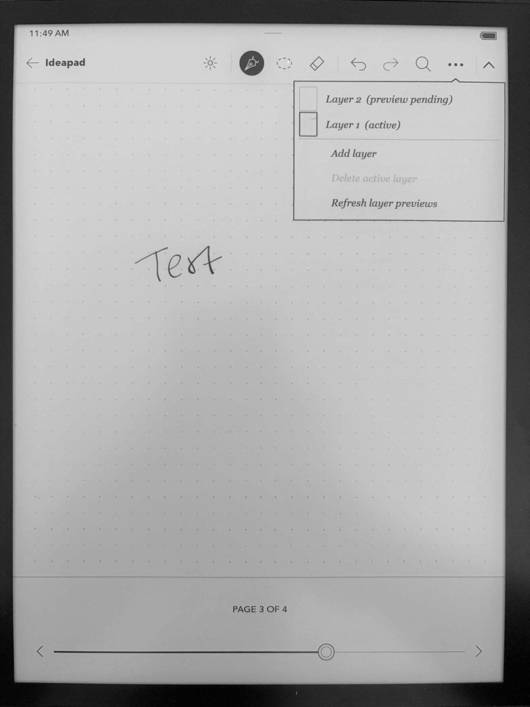
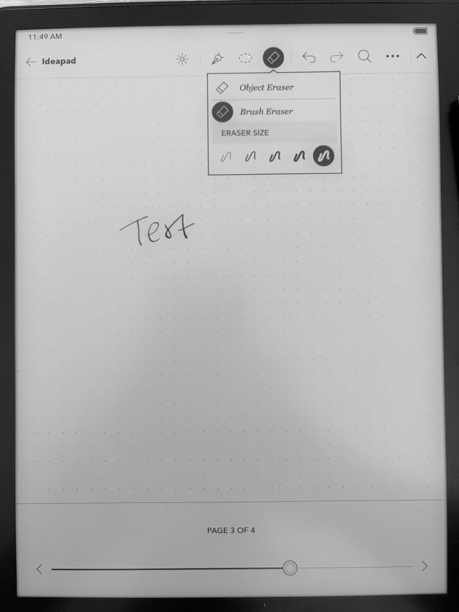
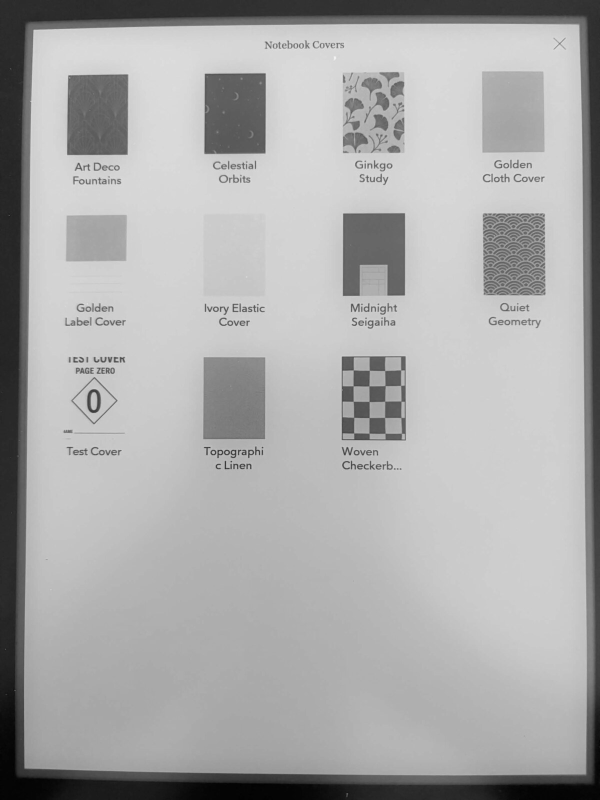
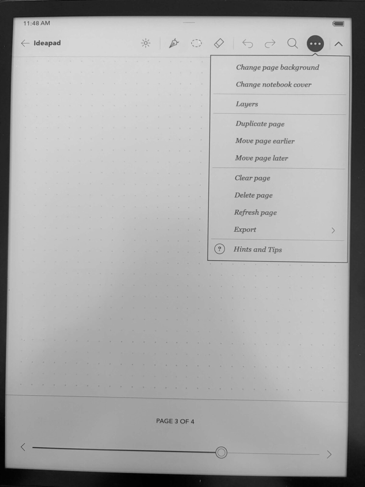
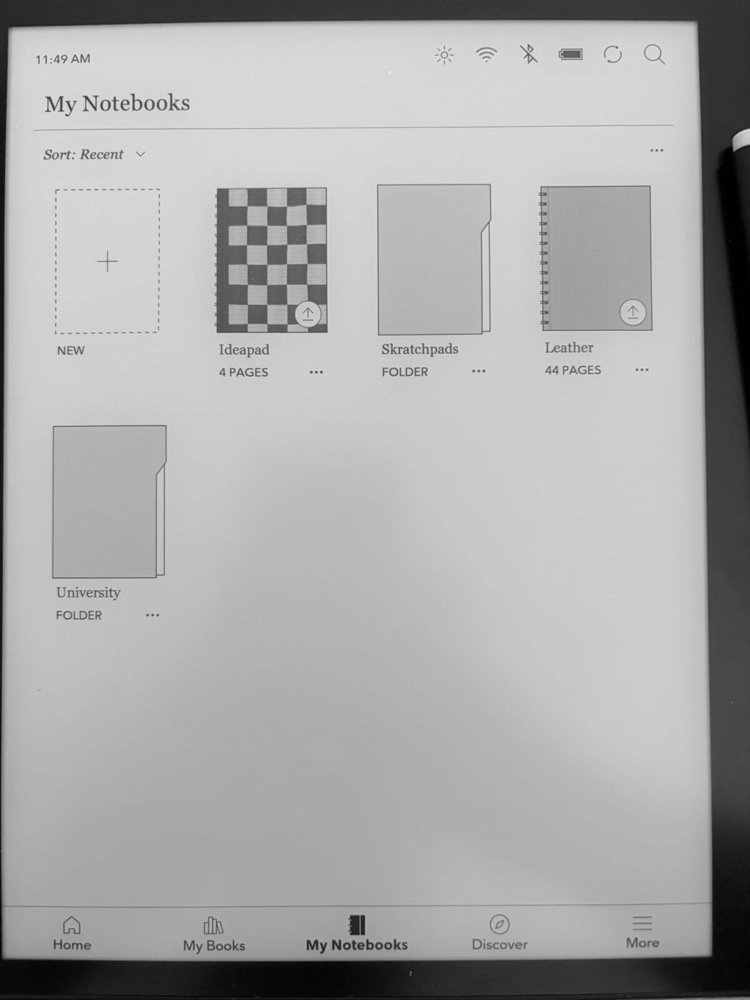

# KoboNotebookPlus

**Native layers, custom paper templates, writable covers, page tools, and a
configurable eraser for Kobo Advanced Notebooks.**

KoboNotebookPlus is a [NickelHook](https://github.com/pgaskin/NickelHook)
plugin that extends the stock Advanced Notebook experience on the Kobo
Elipsa 2E. Instead of overlaying a separate app, it hooks the native notebook
UI and the MyScript ink engine directly, so layers, previews, and erasing all
behave like built-in features.

## On-device previews

Click any preview to view it at full size.

<table>
  <tr>
    <td align="center">
      <a href="docs/images/previews/layers.jpg">
        
      </a><br>
      <strong>Native layers</strong>
    </td>
    <td align="center">
      <a href="docs/images/previews/eraser-controls.jpg">
        
      </a><br>
      <strong>Eraser controls</strong>
    </td>
  </tr>
  <tr>
    <td align="center">
      <a href="docs/images/previews/cover-picker.jpg">
        
      </a><br>
      <strong>Custom covers</strong>
    </td>
    <td align="center">
      <a href="docs/images/previews/notebook-menu.jpg">
        
      </a><br>
      <strong>Page and notebook tools</strong>
    </td>
  </tr>
  <tr>
    <td align="center" colspan="2">
      <a href="docs/images/previews/notebook-library.jpg">
        
      </a><br>
      <strong>Custom covers in the notebook library</strong>
    </td>
  </tr>
</table>

> [!CAUTION]
> This plugin calls private Kobo and MyScript C++ APIs **by firmware
> address**. It is tested only on a Kobo Elipsa 2E (`condor`) running
> firmware `4.38.23697`. A mismatched build can crash Nickel, corrupt
> notebooks, cause data loss, or force a factory reset. Back up your Kobo
> database, settings, and notebooks first, and test only with disposable
> notebooks. See [Recovery](#recovery) before installing anything.

## Features

- **Layers** — a native-style Layers popup below the notebook toolbar: add,
  select, and delete real MyScript document layers, with per-layer preview
  thumbnails and independent pen/eraser routing per layer.
- **Eraser controls** — brush and object eraser modes plus a five-step
  eraser-size row; the hardware (stylus) eraser follows the configured size.
- **Custom paper templates** — drop in your own full-page PNG templates.
- **Writable covers** — custom notebook covers you can write on as a first
  page.
- **Page operations** — duplicate and reorder notebook pages.
- **Clean library** — plugin support images stay out of Home/My Books
  without touching the Kobo database.

## Status

Experimental, source-only — **no stable binary release yet**. The current
build has passed its host-side ABI, relocation, packaging, and ARM
disassembly checks; final on-device runtime verification is still pending.

## Compatibility

| Item | Supported target |
| --- | --- |
| Device | Kobo Elipsa 2E (`condor`) |
| Firmware | `4.38.23697` |
| Qt | 5.2.1 |
| Compiler | NickelTC GCC 4.9.4, ARM hard-float |

Every private symbol, vtable slot, instruction sequence, and hook relocation
used by the current build is pinned by the verification scripts in
`scripts/`. Supporting a different firmware requires a fresh binary audit —
changing only the version check is unsafe.

## Why source-only

This repository intentionally contains no Kobo firmware, MyScript libraries,
Binary Ninja databases, device backups, notebooks, generated plugins, or
`KoboRoot.tgz`. The install archive embeds a stock `libiinknote.so`, which
you must extract from firmware you obtained yourself; it must not be
redistributed here.

## Building

Requirements: Docker, Python 3, `objdump`, and matching user-extracted
firmware libraries.

```sh
git clone --recurse-submodules https://github.com/MRoiban/KoboNotebookPlus.git
cd KoboNotebookPlus
```

Place the firmware libraries at:

```text
extracted/rootfs/usr/local/Kobo/libiink.so
extracted/rootfs/usr/local/Kobo/libiinknote.so
extracted/rootfs/usr/local/Kobo/libnickel.so.1.0.0
extracted/rootfs/usr/local/Kobo/libiinkuiref.so.1.0.0
mods/custom-notebook-templates/package/libiinknote.so
```

Expected stock `libiinknote.so` SHA-256 for the supported firmware:

```text
f80a7de7a1c482173a89b18f2bb8164fcfb53b8fab9b2a75bd23998813a528ea
```

Run the ABI gates before every build:

```sh
python3 scripts/verify-layer-abi.py
python3 scripts/verify-layer-preview-abi.py
python3 scripts/test-verify-layer-artifacts.py
```

Build only with NickelTC, keeping clean and compile steps sequential:

```sh
docker run --rm -v "$PWD:/work" -w /work \
  ghcr.io/pgaskin/nickeltc:1 \
  make -C mods/custom-notebook-templates clean

docker run --rm -v "$PWD:/work" -w /work \
  ghcr.io/pgaskin/nickeltc:1 \
  make -C mods/custom-notebook-templates -j2

docker run --rm -v "$PWD:/work" -w /work \
  ghcr.io/pgaskin/nickeltc:1 \
  make -C mods/custom-notebook-templates koboroot
```

## Installing

Before installing, inspect the built `KoboRoot.tgz` and confirm it contains
only the compiled ARM plugin and the exact stock library — nothing else.
Never install a package built for a different firmware.

1. Back up `/mnt/onboard/.kobo/KoboReader.sqlite`, `Kobo eReader.conf`, and
   your notebooks.
2. Copy `KoboRoot.tgz` to `/mnt/onboard/.kobo/` over USB.
3. Eject the device; Nickel installs the package and reboots.

## Recovery

If Nickel crash-loops or notebooks misbehave after install:

- Remove the plugin: connect over USB (or telnet, if enabled) and delete the
  plugin `.so` from the NickelHook plugin directory, then reboot.
- If the device will not boot to USB, a factory reset recovers it — this is
  why backups and disposable notebooks are non-negotiable.

## Usage

- **Templates** — copy a full-size (`1404 x 1872`) paper PNG to
  `/mnt/onboard/.kobo/custom/templates/Example.png`.
- **Covers** — copy a full-size cover PNG to
  `/mnt/onboard/.kobo/custom/covers/Example.png`.
- Restart the Kobo after changing templates or covers.
- Inside an Advanced Notebook, the notebook menu gains Covers, Layers, and
  page operations. The eraser popup shows the stock mode choices plus the
  size row.

Layer metadata and preview caches live under `.kobo/custom/layers/`; native
ink stays inside the `.nebo` document. Backups created by cover, page, and
layer operations use the `.nebo.backup` extension so Nickel does not import
them as duplicate notebooks.

## Repository layout

```text
mods/custom-notebook-templates/  Plugin source and NickelTC Makefile
scripts/                         ABI and artifact verification tools
third_party/NickelHook/          Upstream NickelHook submodule
```

## Credits and legal

KoboNotebookPlus is not affiliated with or endorsed by Rakuten Kobo or
MyScript. Kobo and related marks belong to their respective owners.

[NickelHook](https://github.com/pgaskin/NickelHook) by Patrick Gaskin is
included as a separate MIT-licensed submodule.

**License:** this project does not yet have a license. All rights reserved —
public visibility does not grant permission to redistribute or reuse the
source. No cover or template artwork is included because its publication
license has not been established.
